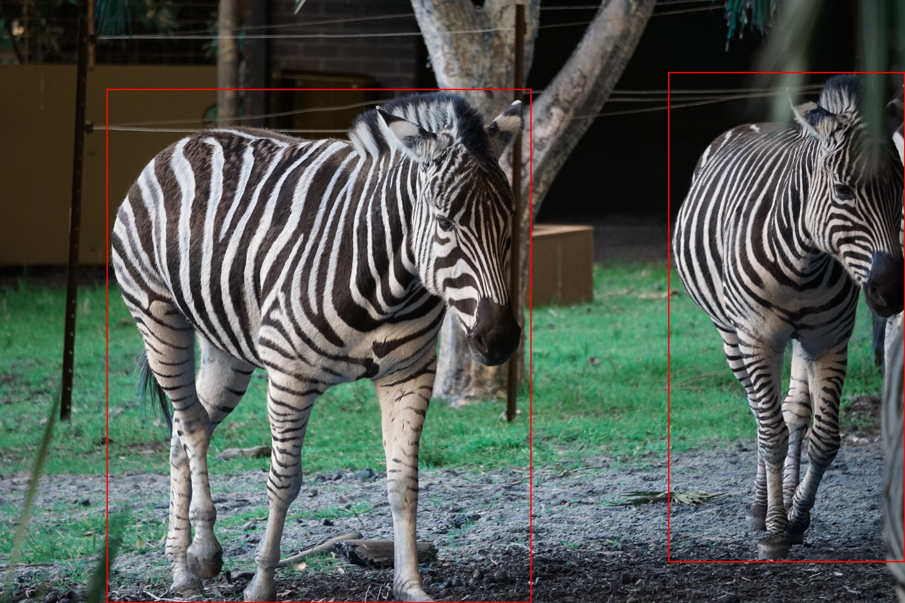
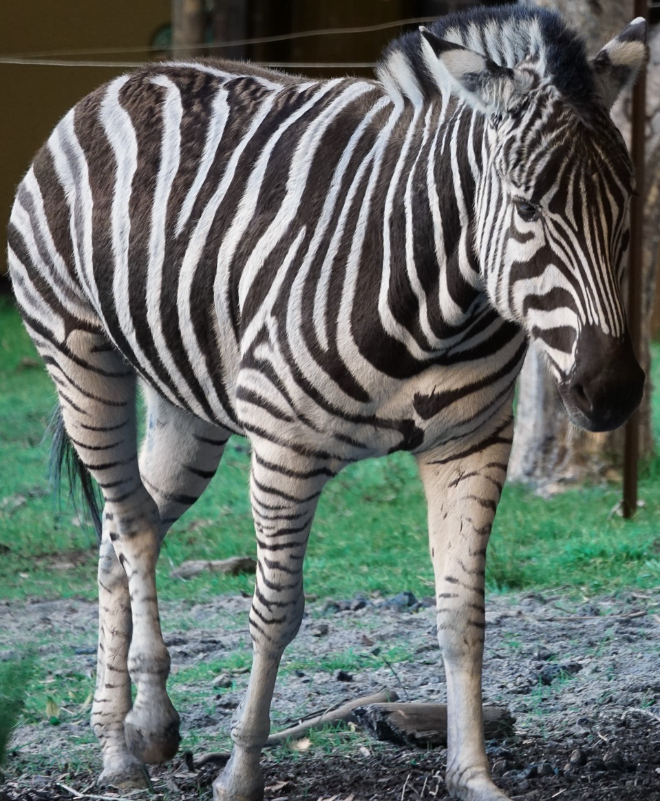
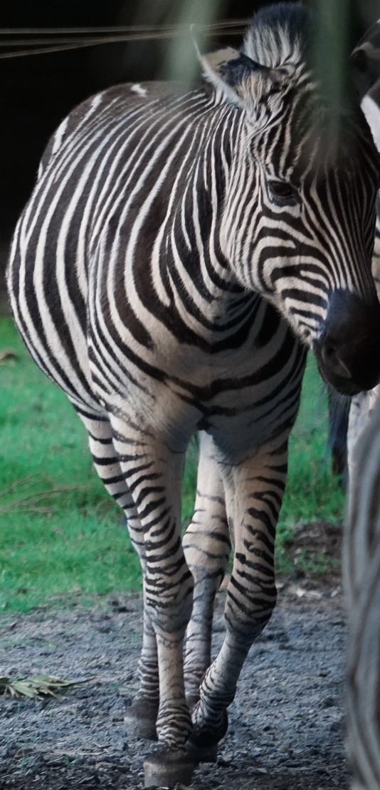

# MegaDetector V5 - ONNX

This project explains how to export the [Megadetector V5](https://github.com/microsoft/CameraTraps/blob/main/megadetector.md) 
models to ONNX format, and provides some tools to easily run inference using the ONNX model.

The motivation for this was to make it simpler to run: exporting to ONNX and running from that environment
requires far fewer dependencies and with much simpler version constraints when compared to the full torch/megadetector/yolov5 
environment.

To further reduce external dependencies, there is also included an implementation of the batched non-maximum-suppression 
algorithm implemented in `numpy`.

The exporting can be complicated, but you can export the ONNX model on any platform where all the requirements are readily 
satisfied, and then run inference on another with just the minimal dependencies.

There are also instructions on converting the ONNX model to TensorRT to run on Nvidia GPUs and a tool for running
inference using TensorRT.

The images used as input for inference can come from a number of sources, including:

* image files on disk
* video files on disk
* hierarchies of image and/or video files on disk
* from RaspberryPi camera
* from Jetson Nano CSI camera

Details on how to specify these sources are found in the 'Running Inference' document linked below.

Detailed documents for each step can be found at the following links:

* [Exporting to ONNX](/docs/export2onnx.md)
* [Exporting to TensorRT](/docs/onnx2tensorrt.md)
* [Running Inference](/docs/run_inference.md)
* [Other Tools](/docs/other_tools.md)
* [Platform Notes](/docs/platform_notes.md)

## How Does It Work?

Below is a full run through of the environment setup and running inference on a RaspberryPi 4b with 8GBytes of RAM. It
installs the minimal packages needed to run inference.

It uses an ONNX model already exported (using the instructions in the link above) and available as below. This model
was exported statically, and expects image inputs of resolution 640x512 and a batch size of a single image; the 
`run-onnx.py` tool can determine this from the model (from the actual model, not its name) and resizes them accordingly.

    $ ls -l models
    total 547220
    -rw-r--r-- 1 pi pi 560346651 Nov 15 08:26 md_v5a.0.0_640x512_1.onnx

Clone this repository:

    $ git clone https://github.com/parlaynu/megadetector-v5-onnx.git
    Cloning into 'megadetector-v5-onnx'...
    remote: Enumerating objects: 148, done.
    remote: Counting objects: 100% (148/148), done.
    remote: Compressing objects: 100% (106/106), done.
    remote: Total 148 (delta 92), reused 97 (delta 41), pack-reused 0
    Receiving objects: 100% (148/148), 2.37 MiB | 285.00 KiB/s, done.
    Resolving deltas: 100% (92/92), done.

Create virtual environment:

    $ python3.9 -m venv pyenv
    $ source pyenv/bin/activate

Install dependencies:

    $ cd megadetector-v5-onnx/
    $ pip install -r requirements.txt 
    Looking in indexes: https://pypi.org/simple, https://www.piwheels.org/simple
    Collecting numpy==1.23.4
      Downloading numpy-1.23.4-cp39-cp39-manylinux_2_17_aarch64.manylinux2014_aarch64.whl (14.0 MB)
         |████████████████████████████████| 14.0 MB 5.5 MB/s 
    Collecting opencv-python-headless==4.6.0.66
      Downloading opencv_python_headless-4.6.0.66-cp36-abi3-manylinux_2_17_aarch64.manylinux2014_aarch64.whl (27.2 MB)
         |████████████████████████████████| 27.2 MB 81 kB/s 
    Collecting onnxruntime==1.13.1
      Downloading onnxruntime-1.13.1-cp39-cp39-manylinux_2_27_aarch64.whl (4.3 MB)
         |████████████████████████████████| 4.3 MB 6.3 MB/s 
    Collecting packaging
      Downloading https://www.piwheels.org/simple/packaging/packaging-21.3-py3-none-any.whl (40 kB)
         |████████████████████████████████| 40 kB 137 kB/s 
    Collecting protobuf
      Downloading protobuf-4.21.9-cp37-abi3-manylinux2014_aarch64.whl (403 kB)
         |████████████████████████████████| 403 kB 6.0 MB/s 
    Collecting flatbuffers
      Downloading https://www.piwheels.org/simple/flatbuffers/flatbuffers-20181003210633-py2.py3-none-any.whl (14 kB)
    Collecting sympy
      Downloading https://www.piwheels.org/simple/sympy/sympy-1.11.1-py3-none-any.whl (6.5 MB)
         |████████████████████████████████| 6.5 MB 738 kB/s 
    Collecting coloredlogs
      Downloading https://www.piwheels.org/simple/coloredlogs/coloredlogs-15.0.1-py2.py3-none-any.whl (46 kB)
         |████████████████████████████████| 46 kB 1.1 MB/s 
    Collecting humanfriendly>=9.1
      Downloading https://www.piwheels.org/simple/humanfriendly/humanfriendly-10.0-py2.py3-none-any.whl (89 kB)
         |████████████████████████████████| 89 kB 2.2 MB/s 
    Collecting pyparsing!=3.0.5,>=2.0.2
      Downloading https://www.piwheels.org/simple/pyparsing/pyparsing-3.0.9-py3-none-any.whl (98 kB)
         |████████████████████████████████| 98 kB 330 kB/s 
    Collecting mpmath>=0.19
      Downloading https://www.piwheels.org/simple/mpmath/mpmath-1.2.1-py3-none-any.whl (532 kB)
         |████████████████████████████████| 532 kB 382 kB/s 
    Installing collected packages: pyparsing, mpmath, humanfriendly, sympy, protobuf, packaging, numpy, flatbuffers, coloredlogs, opencv-python-headless, onnxruntime

Run the inference:

    $ ./tools/run-onnx.py -p -x \
                    ../models/md_v5a.0.0_640x512_1.onnx \
                    ./images/original \
                    ../outputs
    preparing session
    - available providers: ['CPUExecutionProvider']
    - in use providers: ['CPUExecutionProvider']
    building pipeline
    - input shape: [1, 3, 512, 640]
    - output shape: [1, 20400, 8]
    running
    000000 loading ./images/original/DSC04446.jpg
    - resizing from 2048x1365 to 640x426
    - padding from 640x426 to 640x512
    - 00: found 2 objects
    summary
    - total runtime: 6.91
    -       average: 6.91
    

The resulting outputs are below. The first image is the full input with bounding boxes around the animals;
the second row has the individual animals cut into separate images.

<table>
    <tr>
        <td colspan="2"></td>
    </tr>
    <tr>
        <td></td>
        <td></td>
    </tr>
</table>

## References

* https://github.com/microsoft/CameraTraps/blob/main/megadetector.md
* https://github.com/ultralytics/yolov5

